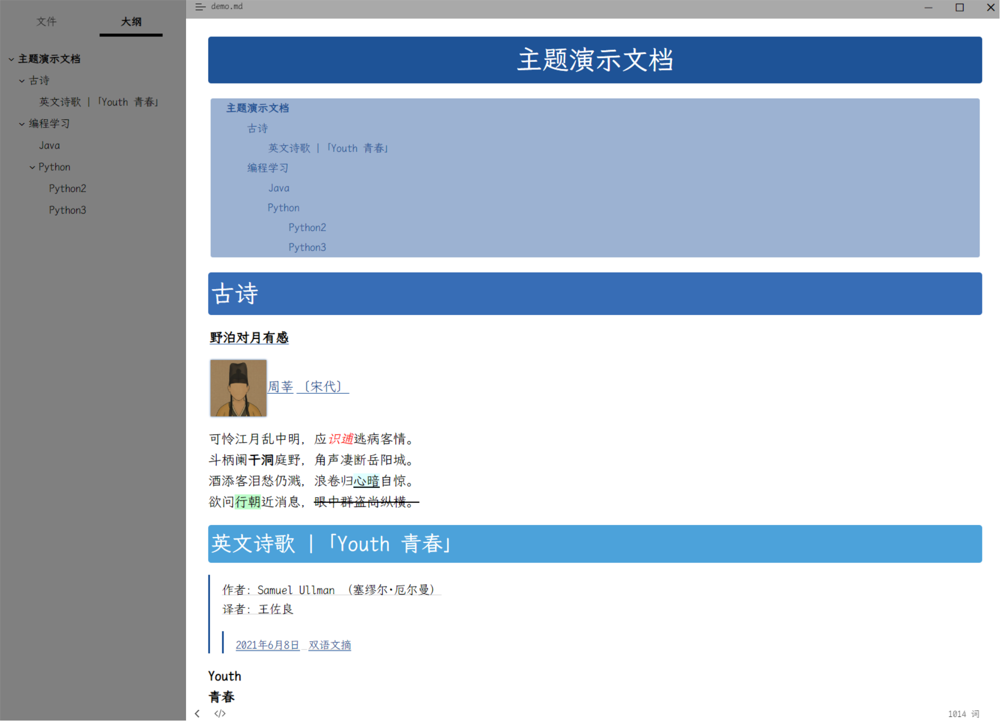
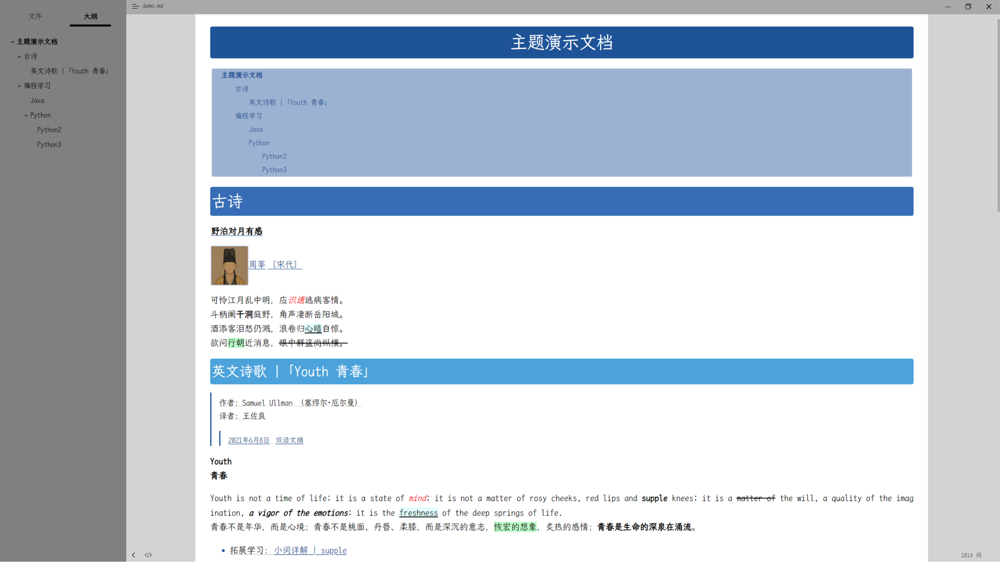
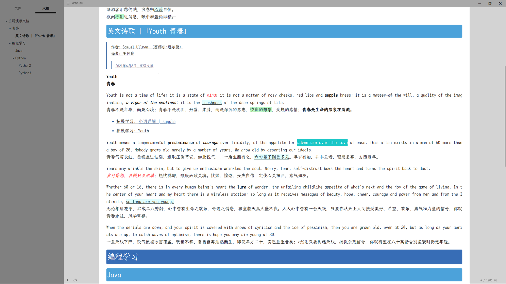
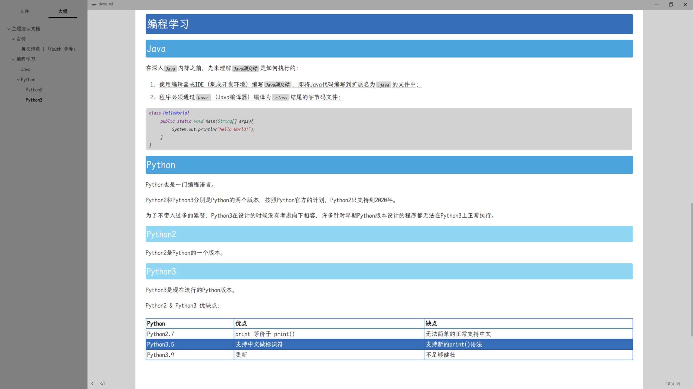

# iWonder Typora Theme

一款让重点更突出、醒目的主题，从大学用到工作，diy 版

upstream：[ThymeiWonder/theme.typora.iWonder](https://github.com/ThymeiWonder/theme.typora.iWonder.git)

typora：https://typora.io

## diy

通过修改 `iWonder > colorScheme > default.css` 和 `iWonder > fontScheme > default.css` 中的配置项, 可以任意修改本主题的字体和颜色

示例：假设, 我想要修改一套红色, 宋体字体的主题, 那么我可以：

1. 复制 `iWonder > colorScheme > default.css` 并将之重命名为 `red.css`, 修改其中的颜色为红色系列

2. 复制 `iWonder > fontScheme > default.css` 并将之重命名为 `song.css`, 修改其中的字体为宋体

3. 复制 `i-w-blue.css` 并将之重命名为 `i-w-red.css`

	1. 修改其中 `@import url("iWonder/colorScheme/default.css");` 文本为 `@import url("iWonder/colorScheme/red.css")`
	2. 修改其中 `@import url("iWonder/fontScheme/default.css");` 文本为 `@import url("iWonder/fontScheme/song.css")`

4. Typora 中切换名为 `IWRed` 的主题

## install

1. [下载主题](https://github.com/ReidLv/theme.typora.iWonder/releases/latest)
2. 解压安装包, 将安装包中所有内容粘贴到主题目录，主题目录可通过 `Typora > 菜单 > 主题 > 打开主题文件夹` 打开.
3. 重启 Typora 后, 切换主题（主题名格式：`IWxxxx`）

linux 目录：`$HOME/.config/Typora/themes`

## shortcut key

| Function   | 功能       | 快捷键         |
| ---------- | ---------- | -------------- |
| Find       | 查找       | `Ctrl+F`       |
| Replace    | 替换       | `Ctrl+R`       |
| Strong     | 加粗       | `Ctrl+B`       |
| Emphasis   | 斜体       | `Ctrl+I`       |
| Strike     | 删除线     | `Ctrl+D`       |
| Underline  | 下划线     | `Ctrl+U`       |
| Highlight  | 高亮       | `Ctrl+H`       |
| Hyperlink  | 超链接     | `Ctrl+L`       |
| Code       | 代码块     | `Ctrl+K`       |
| CodeFences | 多行代码块 | `Ctrl+Shift+K` |
| Image      | 图片       | `Ctrl+Shift+I` |

## preview

---

---

---

